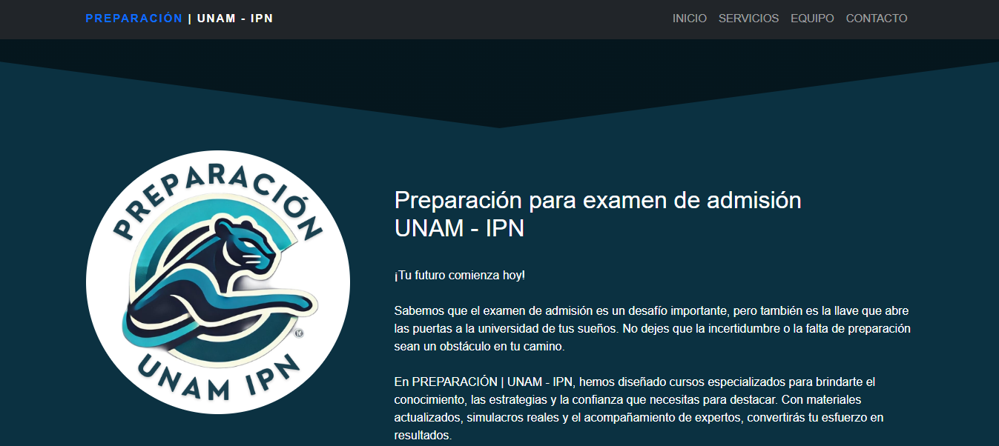

# 📚 Preparación UNAM-IPN - Curso Web

Proyecto desarrollado como práctica de desarrollo web para crear una página de curso de preparación para exámenes de admisión a **UNAM e IPN**.

## 📌 Descripción
Este repositorio contiene una página web diseñada como portal informativo para un curso de preparación enfocado en exámenes de ingreso a nivel medio superior y superior.  
El objetivo fue aplicar conocimientos de HTML, CSS y diseño web para crear una experiencia visual profesional, motivadora y funcional.

## 🎯 Objetivos del proyecto
- Practicar estructura avanzada en HTML
- Diseñar una página web temática para preparación académica
- Aplicar estilos visuales institucionales (azul UNAM, guinda IPN)
- Crear una landing page informativa con llamados a la acción
- Incluir secciones de servicios, asesores y registro

## 🛠️ Tecnologías utilizadas
- HTML5
- CSS
- Diseño responsivo
- GitHub Pages para despliegue
- Formularios de contacto integrados

## 🌐 Demo en vivo
Puedes ver la página del curso funcionando aquí:  
👉 [https://jrc501.github.io/Preparacion-UNAM-IPN/](https://jrc501.github.io/Preparacion-UNAM-IPN/)

## 🚀 Vista previa

  
   
  <em>Plataforma de preparación para exámenes de admisión</em>

## 🚧 Próximas mejoras
- [ ] Agregar simulador de examen en línea
- [ ] Implementar área de alumnos con dashboard
- [ ] Añadir videos de muestra de clases

## 👨‍💻 Autor
**Juan Reyes**  
💻 Ing. en Computación en formación  
🎨 Interés en desarrollo web y tecnología  
📍 México  

---

📖 *Hecho con 💙 para impulsar el futuro académico de los estudiantes* 🎓
